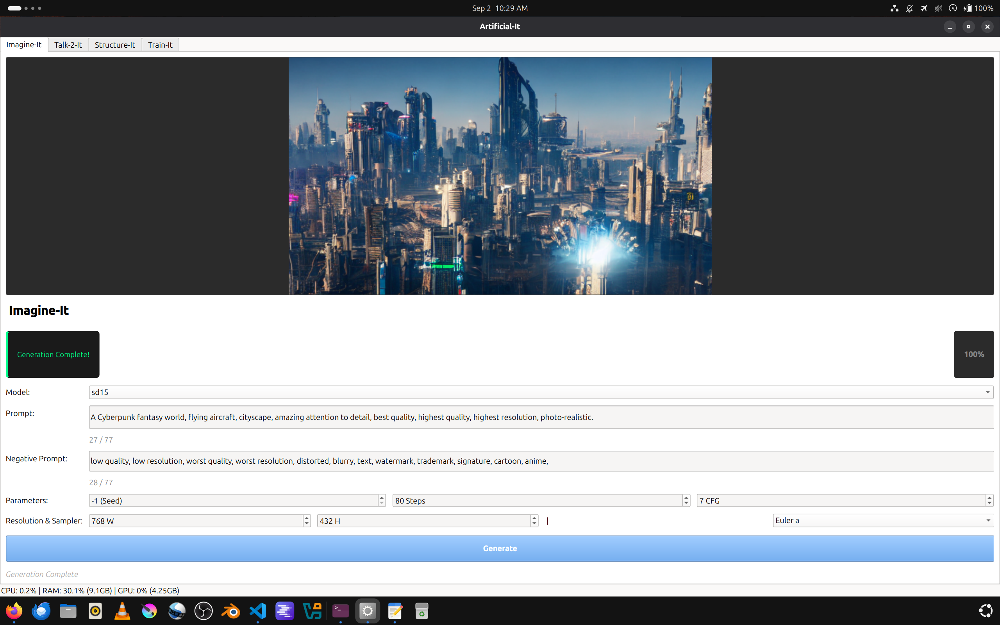

# Artificial-It 



## Project Description
Artificial-It is a desktop application for generating images, chat, dataset preparation, and Model/LoRA training. This project is in an early-stage of active-development and should be considered a pre-release(beta). Most features have not been implemented yet. Current state is very minimal as of September, 2nd, 2026.   

## License MIT
 
## Features
 - Live Preview
 - Steps
 - CFG
 - Seed
 - Positive/Negative Prompts
 - Resolution
 - Token counter(SD1.5 only supports 77 token prompts)
 - Status on the left, progress on the right
 - Sampler selection(not working yet)
 - Resource Monitor
 - Empty tabs: Talk-2-It, Structure-It, and Train-It(**Coming Soon!**)

## Prerequisites
 - python >=3.12
 - pip for installing dependencies/requirements.
 - GPU with enough VRAM to load the full-merged-checkpoint(UNet, VAE, Clip), 8GB Suggested-Minimum.

## Installation (Ubuntu 26.04)

 - **Step (1)**: Clone the repository.
```bash
git clone https://github.com/RobertSullender/Artificial-It.git
```

 - **Step (2)**: Change directory.
```bash
cd Artificial-It
```

 - **Step (3)**: Create a python virtual environment.
```bash
python3 -m venv .venv
```

 - **Step (4)**: Activate your virtual environment.
```bash
source .venv/bin/activate
```

 - **Step (5)**: Install requirements.
```bash
pip install -r requirements.txt
```

 - **Step (6)**: Add Artificial-It to the Ubuntu application menu.
```bash
mkdir -p ~/.local/share/applications
cp Artificial-It.desktop ~/.local/share/applications/
update-desktop-database ~/.local/share/applications 2>/dev/null || true
```
   - The included launcher uses this checkout's absolute path and virtual environment. If the repository is moved, update `Artificial-It.desktop` before copying it again.

 - **Step (7)**: Start the program.
```bash
python src/main.py
```

 - **Step (8)**: Download the model.
    - https://huggingface.co/stable-diffusion-v1-5/stable-diffusion-v1-5/blob/main/v1-5-pruned.safetensors
    - Place the v1-5-pruned.safetensors file in the auto-generated models folder.

## Notes
 - Closing the terminal, used to start the application, will kill the application.
 - Do not install requirements(**Step (5)**) into the system python make sure you are inside your active venv(**Step (4)**).
 - Use deactivate to kill the python virtual environment.
```bash
deactivate
```

## Restarting
 - If you would like to start the application again, simply open a terminal and follow these commands.
```bash
cd Artificial-It
```
```bash
source .venv/bin/activate
```
```bash
python src/main.py
```

